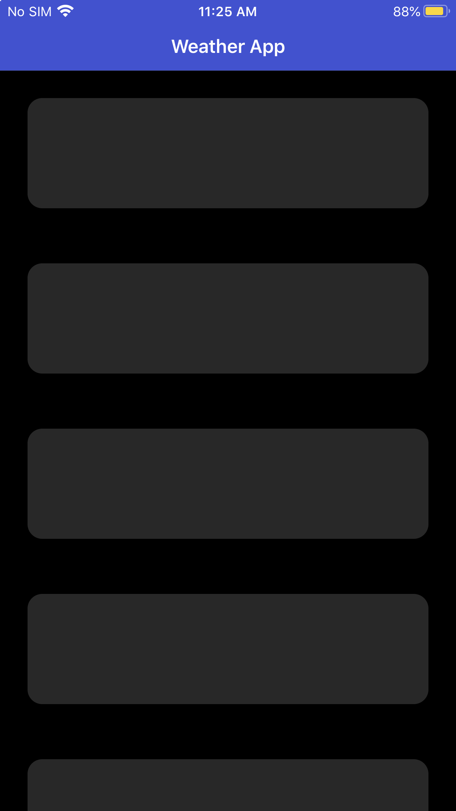
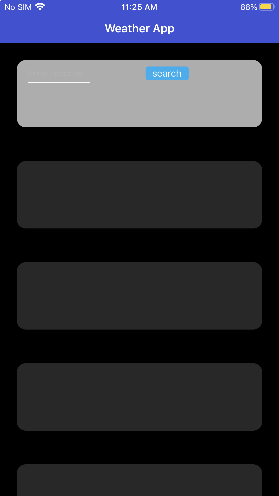
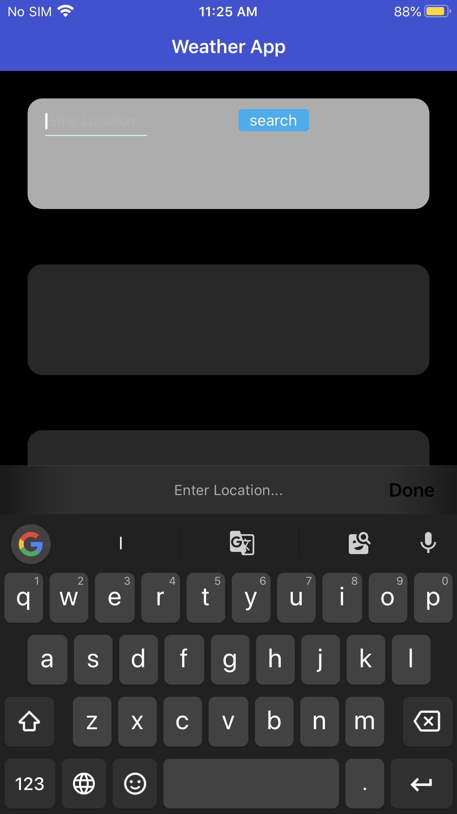
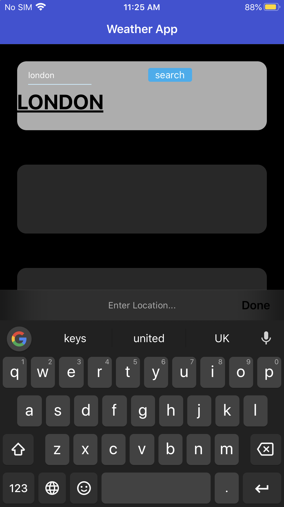
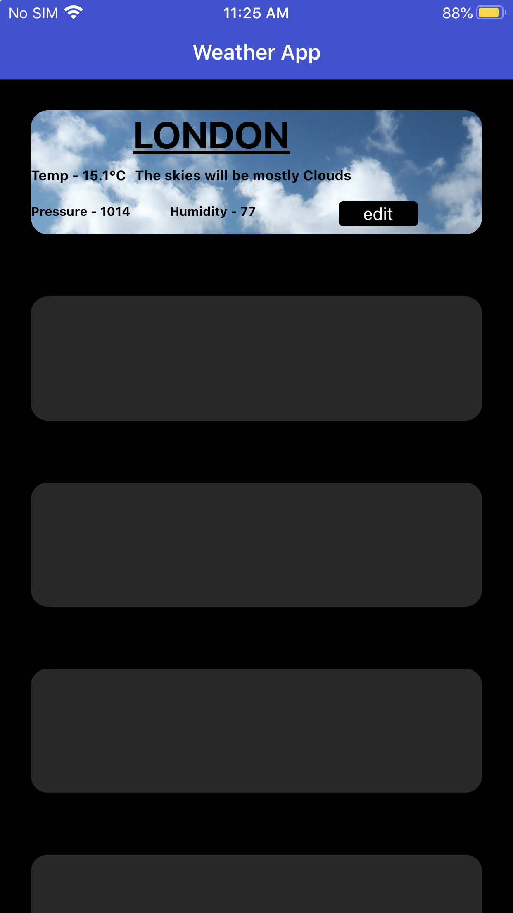

# WeatherApp
Weather app is the little web app for displaying the weather report from openweathermap.org using Components, Databinding, HTTP, Services, Observables, HTML5, CSS3...!


## App features
1. The app consists of a list of panels. Every panel shows the weather data of one city. Initially, all panels would be empty.

2. On tapping on an empty panel, a text box is shown on the panel itself, asking the user to enter the city name. On entering the name, the panel now shows weather data for that city.

3. Every panel have an “Edit” button - on clicking this, the user will be able to change the city shown in that panel. 

4. If there was an error in getting the data (eg. wrong city name),the panel shows the error and the user can re-enter the city name.

5. Every panel has a background picture that describes the weather at the city - eg. sunny/rainy/cloudy.

6. Every panel shows city name,temperature,pressure,humidity,and weather condtion.
## API Used


## Prerequisites  
1. Install [Node.js®](https://nodejs.org/en/download) and npm
    ```
      node -v 
      
      npm -v
    ``` 
2. Install node packages and go to directory having package.json (cd /go/to/app/directory having package.json)
    ```
      npm install
    ```
3. Install the latest NativeScript CLI type the following command in a Command Prompt or Terminal.
    ```
      npm install -g nativescript@latest
    ```
4. Navigate to your project folder and run the following command to start previewing your app.
    ```
      tns preview
    ```
    
 ## Project Looks like  






